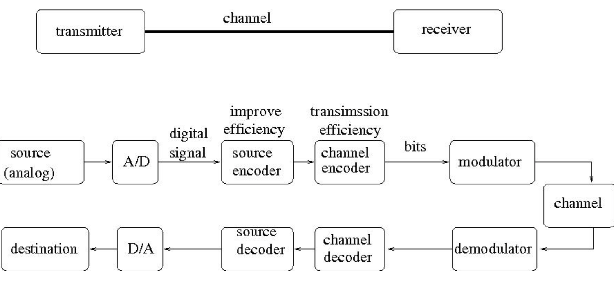
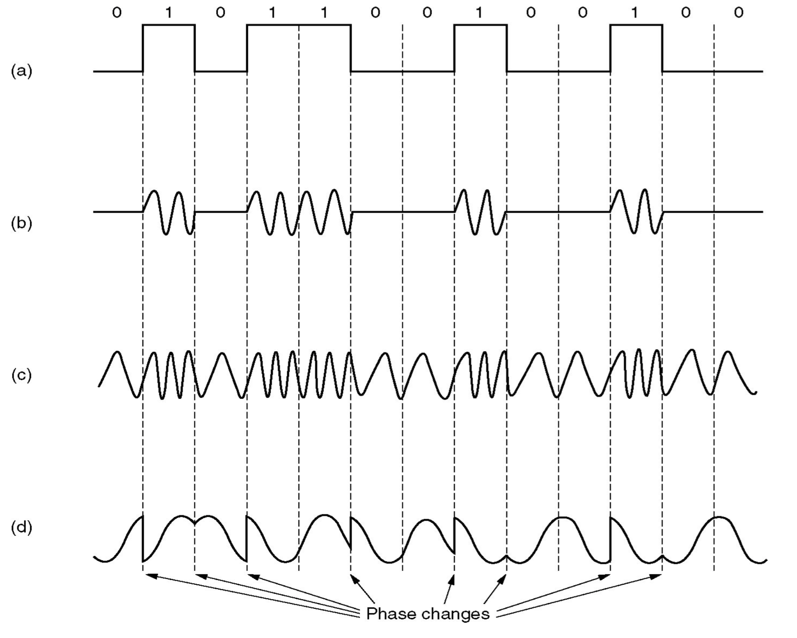
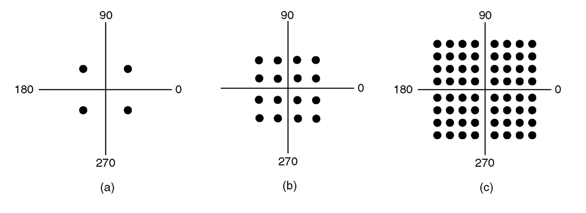

# Lecture 4 - Notes  

**January 14, 2016**  

## Physical Layer Internet Access

* __Analogue Communication__: an analogue signal as a waveform. For example your voice or a record player.
* __Digital Communication__: a digital signal, serialized into bits. Can be used to simulate analogue but can also be native binary data. For example an MP3 over the internet or a webpage.

## A Digital Communication System

As shown in the image above we send an analogue source to an analogue to digital converter then a Modulator which sends it over our communication channel. We receive it and perform the the decoding steps before it arrives at the destination. Modulator-Demodulators (MODEMs) are used to convert the signal for transfer.

## Modems

The signal starts in the frequency domain and has infinite harmonics. The channel has limited bandwidth[^bandwidth] and can help to compress? the signal.

[^bandwidth]: The difference between the highest and lowest frequencies that can be transferred without strong attenuation.

* __a.__ A binary signal
* __b.__ An Amplitude Modulation (AM) Signal
* __c.__ An Frequency Modulation (FM) Signal
* __d.__ An Phase Modulation Signal

The most common form of modulation today is Quadrature Amplitude Modulation (QAM). Below we have a number of constellation diagrams representing different QAMs.

* __a.__ QPSK
* __b.__ QAM-16
* __c.__ QAM-64

With 16 bits of modulation (QAM-16) we can send four bits of data. Since,

$$
    \log_2{V}
$$

The example below shows the mapping of bits to symbols in QAM-16.

## Nyquist Limit

If an arbitrary signal has been run through a low-pass filter of bandwidth $H$, the filtered signal can be completely constructed by making only $2H$ samples per second. So the maximum speed of a noiseless channel is,

$$
    2H \log_2{(V)} ~\text{bps}
$$

where $V$ is the number of symbols in the constellation and $H$ is the bandwidth. In summary,

* __Baud Rate__: The # of samples per second
* __Symbol Rate__: Each baud $\iff$ one symbol
* __Data Rate__: $2H \log_2{(V)}$ bps

## Shannon Limit

For any degree of noise contamination ($N$) on a communication channel it is possible to communicate discrete data near error free at a maximum rate of

$$
    H \log_2{\left( 1 + \frac{S}{N}\right)} ~\text{bps}
$$

where $\frac{S}{N}$ is the signal to noise ratio and $H$ is the bandwidth.   

## Internet access through a Phone

The first access was through analogue dialup. A Modem was used on a telephone line with unshielded twisted pair (UTP). You could receive at up to 56 Kbps down. It had an $8~\text{KHz}$ band, $8$ symbols per second and 256-QAM (8 bits). 

### Asymmetric DSL (ADSL)

ADSL was introduced to free up more bandwidth. It provides upstream and downstream at the same time. The DSL modem is then connect to your computer.

## Internet access through a Cable Line

This uses a a shared coaxial cable, internet access is provided through Hybrid Fibre Coaxial (HFC) Protocol (DOCSIS). They divided the frequency band into sections for different tasks. 

