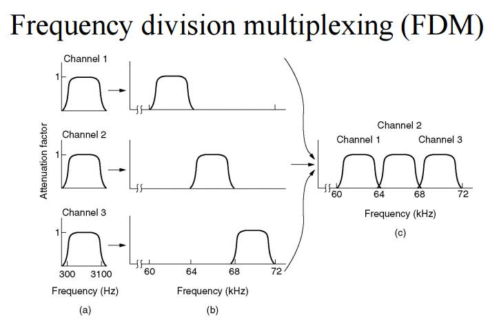
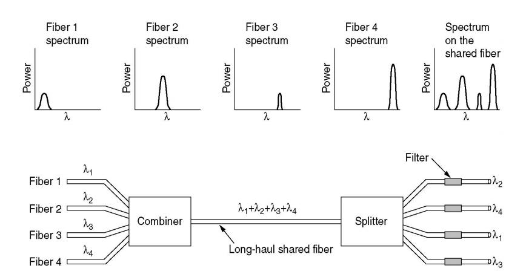
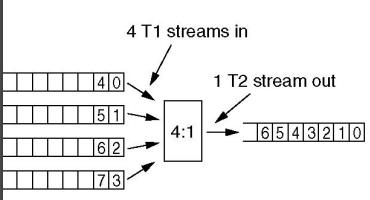

# Lecture 5 - Notes

**January 18, 2016**

## Physical Layer Internet Backbone

### Internet access

* Phone Line
    * [Dialup](https://en.wikipedia.org/wiki/Dial-up_Internet_access)
    * [Digital Subscriber Line (DSL)](https://en.wikipedia.org/wiki/Digital_subscriber_line)
    * [Asynchronous Digital Subscriber Line (ADSL)](https://en.wikipedia.org/wiki/Asymmetric_digital_subscriber_line)
* Cable Line
    * [Broadband Modem](https://en.wikipedia.org/wiki/Broadband)
* Ethernet
    * [Local Area Network (LAN)](https://en.wikipedia.org/wiki/Local_area_network)
* Wireless
    * [WiFi](https://en.wikipedia.org/wiki/Wi-Fi)
    * [Wireless Local Area Network (WLAN)](https://en.wikipedia.org/wiki/Wireless_LAN)
    * [Wireless Metropolitan Area Network (WMAN)](https://en.wikipedia.org/wiki/Metropolitan_area_network)
    * [Cellular](https://en.wikipedia.org/wiki/Cellular_network)

## Switching Technologies

* **Circuit Switched**: Each message requests a transmission line, when granted it transmits on an assigned line.
* **Message Switched**: Messages are sent sequentially on separate lines.
* **Packet Switching**: Packets are sent on separate lines and decoded at the end.

## Multiplexing

* A way of sending multiple signals or streams of information over communications link at the same time.

### Frequency-Division Multiplexing (FDM)
* The total available bandwith in a channel is divided into no overlapping sub channels each of which is used to carry a separate signal
* Typically used for radio

* Example: _Suppose a long-distance cable is available with a bandwidth allotment of three megahertz (3 MHz). This is 3,000 kHz, so in theory, it is possible to place 1,000 signals, each 3 kHz wide, into the long-distance channel. The circuit that does this is known as a multiplexer. It accepts the input from each individual end user, and generates a signal on a different frequency for each of the inputs._
[source](http://searchnetworking.techtarget.com/definition/frequency-division-multiplexing)

### Wavelength Division Multiplexing (WDM)
* Multiplexing is done by using different wavelengths (colors) of light as the sub channels.

* WDM is multiplexing for optical channels

### Time-Division Multiplexing (TDM)

* Synchronized switches at each end of the transmission line multiplex and demultiplex the streams of data so that each signal appears on the line only a fraction of time in an alternating pattern.

* In the image, when 4 streams are multiplexed using TDM the bits from any particular stream are spaced apart at interval of 4. So bits at `4*i` (`i` is an integer), Come from stream 1 and `4*i + 1` come from stream 2 and so on.

### Internet Backbone
- TO DO
